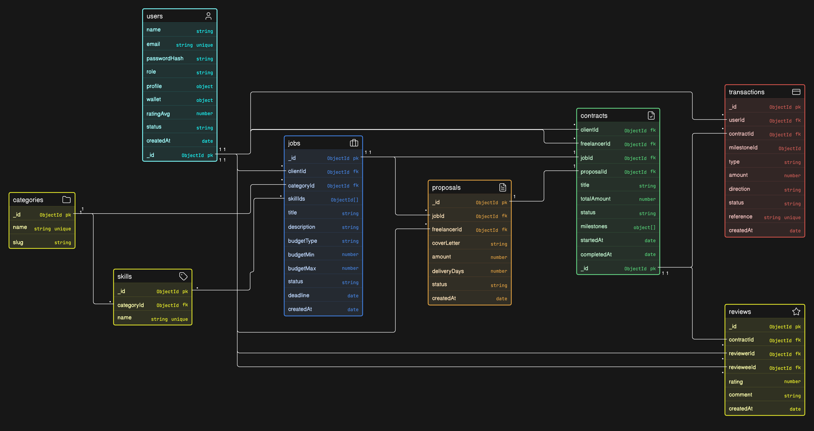

# Project Name

GCC Talent Freelance Marketplace

## Overview

GCC Talent Marketplace is an online platform similar to Upwork and Fiverr. Clients publish jobs or
browse ready-made service packages, freelancers showcase their skills and submit proposals, and
both sides collaborate, deliver and pay securely through the platform. An admin team keeps the
marketplace safe and fair.

## Technologies Used

- **Runtime Environemnt:** Node.js
- **Framework:** Express
- **Database:** MongoBD
- **Authentication:** JWT


## Installation
 
Follow these steps to set up and run the React frontend locally.
 
### Prerequisites
 
- [Node.js](https://nodejs.org/) (v18 or higher recommended)
- npm (comes with Node.js)

### Steps
 
1. **Create a folder for your project and cd into it**
```bash
   mkdir gcc-talent-backend
   cd gcc-talent-backend
```
 
2. **Perform the following commands in the command line**
```bash
   git clone git@github.com:FnrDev/quizly-backend.git
   rm -rf .git
   rm README.md
```
 
3. **Create a `.env` file with the following values**
```env
    MONGODB_URI=your-connection-string
    PORT=3000
    CLIENT_URL=http://localhost:5173
    JWT_SECRET=super-secret-key-no-one-would-guess
```
 
4. **run:**
```bash
   npm i
```
 
5. **run:**
```bash
   npm run dev
```
 
   The app should now be running at `http://localhost:3000`.
 
---


## Database Design




## Routes


## Credits