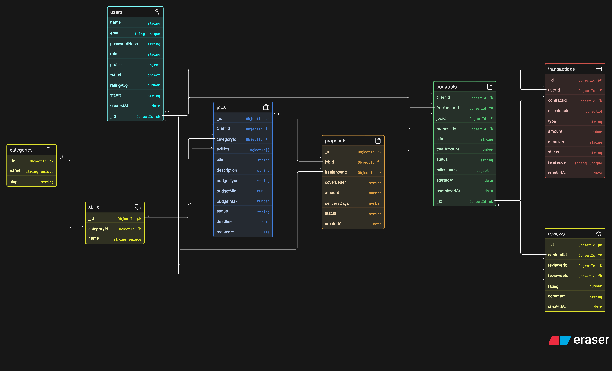

# GCC Talent Freelance Marketplace

## Overview

GCC Talent Marketplace is an online platform similar to Upwork and Fiverr. Clients publish jobs or
browse ready-made service packages, freelancers showcase their skills and submit proposals, and
both sides collaborate, deliver and pay securely through the platform. An admin team keeps the
marketplace safe and fair.

## Technologies Used

- **Runtime Environemnt:** Node.js
- **Framework:** Express
- **Database:** MongoBD
- **Authentication:** JWT


## Installation
 
Follow these steps to set up and run the backend locally.
 
### Prerequisites
 
- [Node.js](https://nodejs.org/) (v20.19 or higher)
- npm (comes with Node.js)

### Steps
 
1. **Create a folder for your project and cd into it**
```bash
   mkdir gcc-talent-backend
   cd gcc-talent-backend
```
 
2. **Perform the following commands in the command line**
```bash
   git clone https://github.com/FnrDev/gcc-talent-backend.git .
   rm -rf .git
   rm README.md
```
 
3. **Copy `.env.example` to `.env` and configure the following values**
```env
    MONGODB_URI=your-connection-string
    PORT=3000
    CLIENT_URL=http://localhost:5173
    JWT_SECRET=super-secret-key-no-one-would-guess
    JWT_REFRESH_SECRET=a-different-long-random-secret
    RESEND_API_KEY=your-resend-api-key
    RESEND_FROM_EMAIL="GCC Talent <noreply@your-domain.com>"
    API_BASE_URL=http://localhost:3000
    R2_ACCOUNT_ID=your-cloudflare-account-id
    R2_ACCESS_KEY_ID=your-r2-access-key-id
    R2_SECRET_ACCESS_KEY=your-r2-secret-access-key
    R2_JURISDICTION=default
    R2_PUBLIC_BASE_URL=https://files.your-domain.com
```

Use a real Resend sending key and an address on a [verified Resend domain](https://resend.com/docs/dashboard/domains/introduction).
Keep the key in `.env` locally or the deployment's secret environment variables; never put it in frontend code.
`API_BASE_URL` is the externally reachable **backend** URL used in email links, including any reverse-proxy
base path. Production requires this setting to use HTTPS; localhost links only work on the machine running the API.
`CLIENT_URL` is the frontend base URL used for CORS, password reset links, and service-order contract links.
Use a public HTTPS URL in production.
Missing or invalid email configuration makes registration return
`503` before creating an account.

Attachment uploads use the Cloudflare R2 bucket named `gcc-talent`. Create an R2 API token with
Object Read & Write access scoped to that bucket. Keep both R2 credentials in `.env` or deployment
secrets, never in frontend code. `R2_PUBLIC_BASE_URL` must be the bucket's public custom-domain origin
in production. Cloudflare's generated `r2.dev` URL can be used for development after public access is
enabled, but it is rate-limited and not intended for production. The S3 API endpoint is not a public
file URL. Set `R2_JURISDICTION` to `eu`, `us`, or `fedramp` only when the bucket was created in that
jurisdiction; otherwise keep `default`.

`R2_PUBLIC_BASE_URL` deliberately makes the returned object URL anonymously readable. Anyone who
obtains that URL can download the attachment; `Cache-Control: no-store` does not provide access
control. Do not use this public URL flow for confidential resumes, proposals, or work product. Those
need a private bucket plus an authenticated download endpoint or short-lived presigned GET URLs.
 
4. **run:**
```bash
   npm i
```
 
5. **run:**
```bash
   npm run dev
```
 
   The app should now be running at `http://localhost:3000`.
 
---


## Database Design



### Audit logs

The `AuditLog` model stores create, update, and delete events in MongoDB's `audit_logs`
collection. All existing mutation controllers use the shared `services/audit.service.js`
logger: accounts/authentication, both profile types, users/admin, categories, skills, services, jobs,
proposals, contracts/milestones, reviews, wallets, financial ledger entries, and R2 attachment
uploads. Read-only
controllers do not create audit records. This records new changes; it does not backfill history.

Each entry includes:

- `actor`: the initiating user's ID, or `null` for anonymous requests; `actorType` distinguishes
  `user`, `anonymous`, and `system`. Password-reset requests remain anonymous even when their
  email matches an account. Verified reset/verification tokens and successful logins can identify
  the acting user. IDs remain in the log after an account or resource is deleted.
- `action`: `create`, `update`, or `delete`; `resource` is the affected resource type and
  `resourceId` is the document ID for MongoDB-backed records. Embedded milestone/delivery changes
  are Contract updates. R2 uploads use resource `Attachment`, a null resource ID, and place their
  server-generated object key in `details`. Bulk proposal declines use a null resource ID, an
  `affectedCount`, and a scoped filter in `details` rather than pretending one document represents
  the entire batch.
- `details`: a controller operation name and curated changed fields or relevant values.
  It is not a complete before/after snapshot. Credentials, passwords, tokens and hashes are
  never passed by controllers; sensitive keys are defensively redacted and details are size-limited.
- `request`: a server-generated correlation `id`, HTTP `method`, route `path`, and `ip`.
  Related/cascading writes share an ID. Query strings, request bodies and headers are not stored.
- `createdAt`: when the audit entry was created. Indexes support time, actor, resource, action,
  and request-ID lookups. There is no automatic expiration or public audit read/write endpoint.

Administrators can read logs at `GET /admin/audit-logs`; the frontend exposes this under
**Admin → Audit logs** (`/admin?section=audit-logs`). This endpoint uses the existing live
admin authorization and never writes audit entries. It supports `page`, `limit` (up to 100),
`action`, `resource`, exact `actor`/`resourceId` filters, `search` (operation, endpoint, or exact
IDs), and `from`/`to` ISO timestamp bounds. Results use `{ logs, pagination }`, newest first
with an ID tie-breaker. Each row retains its original `actor` ID and adds a minimal
`actorUser: { _id, name, email }` summary when that account still exists. Deleted actors
remain identifiable by their recorded ID. Invalid filters return `400`.

Audit inserts are awaited after actual persistence, including background password-reset changes
and compensating updates when email delivery or a wallet operation fails. Rejected requests and
conditional writes that change nothing do not produce success events. Existing MongoDB transactions
pass the same session to the audit insert, so an aborted transaction leaves no audit rows and an
audit failure aborts the transaction. For non-transactional operations, the business write and audit
insert are not atomic: audit failures are reported to the server error log without turning an
already-completed write into a retryable HTTP failure. Monitor `Audit log persistence failed.`;
there is no automatic retry/outbox for those failures.

For a new mutation handler, call the logger immediately after the successful write and before
response population or other fallible follow-up work. Supply the existing session when applicable:

```js
const { recordAuditLog } = require("../services/audit.service");

await recordAuditLog(req, {
  action: "update",
  resource: "Job",
  resourceId: job._id,
  details: { operation: "updateMyJob", changedFields: ["title"] },
  // session, // Include when the business write is inside a transaction.
});
```

Use `recordAuditLogs(req, entries, { session })` for related mutations, passing each created
document's own ID. Use `affectedCount: result.modifiedCount` or `result.deletedCount` for
conditional writes; zero-count entries are skipped. Logs can be queried through `AuditLog`
or directly in MongoDB, for example `db.audit_logs.find({ resource: "Job" }).sort({ createdAt: -1 })`.


## Routes

The routes below define the target REST API contract. Values wrapped in braces, such as
`{jobId}`, are route parameters. Query-string filters are optional unless an endpoint states
otherwise.

### Authentication

| Method | Route | Description | Access |
| --- | --- | --- | --- |
| `POST` | `/auth/register` | Create a client or freelancer account and send a verification email through Resend. | Guest |
| `POST` | `/auth/login` | Authenticate a user and issue access/refresh credentials. | Guest |
| `POST` | `/auth/logout` | Invalidate the refresh credential and end the session. | Authenticated |
| `POST` | `/auth/forgot-password` | Request a password reset email with a 30-minute link. | Guest |
| `POST` | `/auth/reset-password` | Set a new password using a single-use reset token and revoke existing sessions. | Guest |
| `GET` | `/auth/verify-email?token={token}` | Verify an account email address. | Guest |
| `POST` | `/auth/resend-verification` | Send a replacement email-verification link. | Authenticated |

#### Signup email verification (implemented)

- `POST /auth/register` accepts `{ "name": "Your name", "email": "you@your-domain.com", "password": "your-password", "role": "client" }`.
  Roles remain `client` or `freelancer`. A `201` response includes `data.user.isEmailVerified: false`
  and `data.verificationEmailSent`. When Resend accepts the email, that flag is `true`.
- The email contains a link to `GET /auth/verify-email?token=...`. The random token expires after
  24 hours and can be used once. MongoDB stores only its SHA-256 hash. A valid link sets
  `isEmailVerified` to `true` and removes the pending verification fields atomically.
  Browser requests receive a confirmation page; API requests receive JSON. Missing, expired,
  invalid, or reused links return `400`. `HEAD` requests never consume a token.
- Existing login behavior is preserved: an unverified user can still sign in, and login plus
  `/auth/me` report `isEmailVerified`. No verification requirement is added to other API routes.
- `POST /auth/resend-verification` requires `Authorization: Bearer <accessToken>` and no request
  body. It sends to the signed-in account's stored email, enforces a 60-second cooldown, and
  replaces the previous link. Already verified accounts receive `200` without another email;
  suspended accounts receive `403`.
- If initial delivery fails or cannot be confirmed, the account is retained and registration still returns `201`,
  with `data.verificationEmailSent: false` and a clear message. Sign in and request another link
  after one minute. A resend rejected by Resend returns `503` and restores the previous pending link if no
  newer verification operation has replaced it. If the provider times out or delivery is otherwise uncertain,
  the new link remains valid in case the email was accepted; check the inbox or resend after one minute.
  Resend acceptance is not proof of inbox delivery;
  check the Resend dashboard for delivery/bounce status.
- Registration and resend share a limit of five requests per IP per 15 minutes, including successful
  requests. Cooldowns return `429` with `Retry-After`. The IP limiter uses process-local memory;
  use a shared store and configure trusted proxies appropriately for a multi-instance deployment.
- Verification URLs are redacted in application request logs, and verification pages use
  `Cache-Control: no-store` and `Referrer-Policy: no-referrer`. Configure any proxy/access logs to
  redact the token query too. Administrators changing verification status invalidate pending links.

For provider smoke checks, use [Resend's designated test recipients](https://resend.com/docs/knowledge-base/what-email-addresses-to-use-for-testing),
such as `delivered@resend.dev`; do not send test traffic to made-up inboxes. The `onboarding@resend.dev`
sender is for testing, not arbitrary real-user delivery. Disable link tracking for verification emails.
For local testing without your own domain, set `RESEND_FROM_EMAIL="GCC Talent <onboarding@resend.dev>"`
and restart the backend. Sign up using the email address associated with your Resend account;
[Resend rejects other real recipients](https://resend.com/docs/knowledge-base/403-error-resend-dev-domain)
until you verify your own domain and change the sender.
Because the documented verification endpoint uses a direct `GET`, email security scanners may consume
the link before the user opens it; in that case the address is already verified, and the user can sign in.

#### Forgot and reset password (implemented)

- The frontend sign-in page links to `/forgot-password`. Submit `POST /auth/forgot-password`
  with `{ "email": "you@your-domain.com" }`. For valid input, the API responds with the same
  `200` message for existing, unknown, suspended, and recently requested accounts, without waiting
  for account lookup or email delivery. This prevents account discovery through response content
  or provider latency. Invalid email input returns `400`; global configuration or database
  unavailability returns `503`.
- Eligible accounts receive a Resend email linking to `CLIENT_URL/reset-password?token=...`.
  The token is 32 random bytes, stored only as a SHA-256 hash, expires after 30 minutes,
  and can be used once. Requesting a reset does not change the password or invalidate sessions.
  Each account has a 60-second request cooldown; the request endpoint also allows five requests
  per IP per 15 minutes. Cooldown responses remain generic; the IP limit returns `429`.
- On a definite provider rejection, the previous reset token/expiry are restored without
  removing the cooldown or overwriting newer state. On timeouts or uncertain outcomes, the new
  link stays valid in case the email was delivered. Provider failures are logged safely and
  never change the generic request response. Processing runs in the existing Node process,
  so a restart can interrupt delivery; users can request another link after the cooldown.
- The frontend `/reset-password` page collects a new password and confirmation. The token
  remains only in component memory and is removed from the URL; after reloading the page,
  reopen the email link. Merely opening or scanning the link never changes the password.
  Submit `POST /auth/reset-password` with `{ "token": "token-from-email", "newPassword": "your-new-password" }`.
  Passwords require at least eight characters and at most 72 UTF-8 bytes to avoid bcrypt truncation.
- A successful reset returns `200`, atomically consumes the token, stores the bcrypt hash,
  clears the refresh credential, and increments the account's session version. Existing access
  and refresh tokens immediately stop working, including credentials from concurrent login or
  refresh attempts. Users must sign in again; the frontend clears its old local authentication.
  A notification email confirms the password change without including the password or a reset token.
  Notification failure does not undo the successful reset.
- Missing, malformed, expired, suspended-account, or used reset tokens return `400` with
  `code: "INVALID_RESET_TOKEN"`; invalid passwords return `400` with `code: "INVALID_PASSWORD"`.
  The reset endpoint allows ten requests per IP per 15 minutes. Both endpoints use `no-store`
  on controller responses; reset pages use `no-referrer`. Redact reset tokens in frontend/proxy
  access logs as well as application logs.
- Authenticated password changes also invalidate pending reset links and all existing sessions.
  Accounts/tokens created before session versioning continue to work until their password changes.
  No database migration or password change is needed for existing users.

The local `onboarding@resend.dev` sender restriction also applies to password reset and notification
emails: only the Resend account email and designated test recipients are supported until a sending
domain is verified.

### Account

| Method | Route | Description | Access |
| --- | --- | --- | --- |
| `PATCH` | `/users/me` | Update the current user's basic account settings. | Authenticated |
| `PATCH` | `/users/me/password` | Change the current user's password. | Authenticated |
| `PATCH` | `/users/me/preferences` | Update language, notification, and other user preferences. | Authenticated |

### Profiles

| Method | Route | Description | Access |
| --- | --- | --- | --- |
| `GET` | `/profile/me` | Return the current user's editable account and role-specific profile. | Authenticated |
| `PATCH` | `/profile/me` | Update the current user's role-specific profile fields. | Authenticated |
| `GET` | `/profile/{userId}` | Return the safe public user and role-specific profile, up to six current listings, ten recent reviews, and rating/activity counters. | Public |

### Uploads

| Method | Route | Description | Access |
| --- | --- | --- | --- |
| `POST` | `/uploads` | Upload one attachment to Cloudflare R2 and return its file metadata and public URL. | Authenticated |
| `POST` | `/uploads?purpose=service-image` | Upload one public service image and return signed metadata for service creation. | Authenticated |

Send `multipart/form-data` with one file in the `attachment` field. Files are limited to 10 MB and
must be a supported image, PDF, plain-text/CSV, Microsoft Office, or ZIP attachment.
The declared MIME type is allowlisted, but uploaded content is not virus-scanned or content-inspected.
The response's `data.attachment` object contains `url`, `name`, `size`, and `contentType`. Map
`url`, `name`, and `size` into public job attachments. Proposal and delivery schemas currently store
only `url` and `name`, but confidential files in those records must use a private, authorized
download flow rather than this public-URL endpoint.
Use `purpose=service-image` for service galleries. That mode only accepts GIF, JPEG, PNG, and WebP,
checks that the file signature matches its declared image type, stores the object with inline
public-cache headers, and adds a signed `receipt` to the returned
attachment metadata. Service creation accepts up to five ordered image objects and verifies each
receipt against the authenticated freelancer before storing the public metadata; the first image
becomes the marketplace cover. Files uploaded for an unfinished service remain in R2, so clients
should retain confirmed upload metadata when retrying rather than uploading it again.
Uploads are limited to 30 requests per authenticated account per 15 minutes. This limiter uses
process-local memory; configure a shared store when running more than one API instance.

```bash
curl -X POST http://localhost:3000/uploads \
  -H "Authorization: Bearer YOUR_ACCESS_TOKEN" \
  -F "attachment=@./job-brief.pdf"

curl -X POST 'http://localhost:3000/uploads?purpose=service-image' \
  -H "Authorization: Bearer YOUR_ACCESS_TOKEN" \
  -F "attachment=@./service-cover.png"
```

### Jobs

| Method | Route | Description | Access |
| --- | --- | --- | --- |
| `POST` | `/jobs` | Create a draft or open job. | Client |
| `GET` | `/jobs` | Browse jobs using search, category, skill, budget, type, experience, sort, and pagination filters. | Public |
| `GET` | `/jobs/{jobId}` | Return job details and the client summary. | Public |
| `PATCH` | `/jobs/{jobId}` | Edit a job while its status permits changes. | Owning client |
| `DELETE` | `/jobs/{jobId}` | Delete a draft job. | Owning client |
| `POST` | `/jobs/{jobId}/close` | Close an open job. | Owning client |
| `POST` | `/jobs/{jobId}/reopen` | Reopen an eligible closed job. | Owning client |
| `GET` | `/jobs/{jobId}/similar` | Return similar open jobs. | Public |
| `GET` | `/jobs/mine?status={status}&page={page}&limit={limit}` | List the current client's jobs by status with proposal counts. | Client |
| `POST` | `/jobs/{jobId}/save` | Save a job for the current user. | Freelancer |
| `DELETE` | `/jobs/{jobId}/save` | Remove a job from the current user's saved jobs. | Freelancer |
| `GET` | `/jobs/saved?page={page}&limit={limit}` | List the current user's saved jobs. | Freelancer |
| `POST` | `/jobs/{jobId}/invitations` | Invite a freelancer to apply to a job. | Owning client |

### Proposals

| Method | Route | Description | Access |
| --- | --- | --- | --- |
| `POST` | `/jobs/{jobId}/proposals` | Submit one proposal for an open job; reject own-job, duplicate, or closed-job submissions. | Freelancer |
| `GET` | `/proposals/mine?status={status}` | List the current freelancer's proposals. | Freelancer |
| `PATCH` | `/proposals/{proposalId}` | Edit a pending proposal. | Owning freelancer |
| `DELETE` | `/proposals/{proposalId}` | Withdraw a pending proposal. | Owning freelancer |
| `GET` | `/jobs/{jobId}/proposals` | List proposals and freelancer summaries for a job. | Owning client |
| `PATCH` | `/proposals/{proposalId}/status` | Shortlist or decline a proposal, optionally with a reason. | Owning client |
| `POST` | `/proposals/{proposalId}/accept` | Accept a proposal, create a contract, and update competing proposals. | Owning client |

### Contracts

| Method | Route | Description | Access |
| --- | --- | --- | --- |
| `GET` | `/contracts?role={role}&status={status}&sourceType={sourceType}&page={page}&limit={limit}` | List contracts visible to the current user, optionally filtered by party role, contract status, and source type (`job`, `gig`, or `service`). | Authenticated |
| `GET` | `/contracts/{contractId}` | Return a contract and its source, parties, milestones, money, and status. | Contract party |
| `POST` | `/contracts/{contractId}/milestones` | Add a milestone to an eligible contract. | Client party |
| `PATCH` | `/contracts/{contractId}/milestones/{milestoneId}` | Update an unfunded milestone. | Client party |
| `POST` | `/contracts/{contractId}/milestones/{milestoneId}/fund` | Move client funds into milestone escrow. Requires `Idempotency-Key`. | Client party |
| `POST` | `/contracts/{contractId}/milestones/{milestoneId}/deliveries` | Submit a message and attachments as a milestone delivery. | Freelancer party |
| `POST` | `/contracts/{contractId}/milestones/{milestoneId}/approve` | Approve delivery, release escrow, and evaluate contract completion. Requires `Idempotency-Key`. | Client party |
| `POST` | `/contracts/{contractId}/milestones/{milestoneId}/request-revision` | Return a delivered milestone to in-progress with revision comments. | Client party |
| `POST` | `/contracts/{contractId}/cancel` | Cancel an eligible contract and refund funded milestones. Requires `Idempotency-Key`. | Contract party |
| `GET` | `/contracts/{contractId}/workspace` | Return the combined contract workspace summary. | Contract party |
| `GET` | `/contracts/{contractId}/activity` | Return the contract timeline and activity log. | Contract party |
| `GET` | `/contracts/{contractId}/messages` | Return paginated contract messages. | Contract party |

### Wallet

| Method | Route | Description | Access |
| --- | --- | --- | --- |
| `GET` | `/wallet` | Return available, pending, and escrow balance information. | Authenticated |
| `POST` | `/wallet/deposits` | Run the mock checkout and credit the user's wallet. Requires `Idempotency-Key`. | Authenticated |
| `POST` | `/wallet/withdrawals` | Create a simulated payout from the available balance. Requires `Idempotency-Key`. | Freelancer |

### Transactions

| Method | Route | Description | Access |
| --- | --- | --- | --- |
| `GET` | `/transactions?type={type}&status={status}&page={page}&limit={limit}` | Return filtered, paginated transaction history. | Authenticated |
| `GET` | `/transactions/{transactionId}/receipt` | Return a printable or downloadable transaction receipt. | Transaction owner |

### Reviews

| Method | Route | Description | Access |
| --- | --- | --- | --- |
| `POST` | `/contracts/{contractId}/reviews` | Leave one rating and comment for the other contract party. | Contract party |
| `GET` | `/users/{userId}/rating` | Return a user's average rating and review count. | Public |
| `GET` | `/users/{userId}/reviews?page={page}&limit={limit}` | Return a user's reviews, newest first. | Public |
| `GET` | `/services/{serviceId}/reviews?page={page}&limit={limit}` | Return verified reviews associated with a service, newest first. | Public |

### General

| Method | Route | Description | Access |
| --- | --- | --- | --- |
| `GET` | `/home` | Return landing-page categories and featured marketplace content. | Public |
| `GET` | `/dashboard` | Return the current user's role-aware dashboard summary. | Authenticated |
| `GET` | `/search?type={type}&query={query}&page={page}&limit={limit}` | Search jobs, services, or freelancers; `gigs` remains an alias for `services`. | Public |

### Skills

| Method | Route | Description | Access |
| --- | --- | --- | --- |
| `GET` | `/skills?category={categoryId}&categorySlug={slug}&search={query}` | List available skills, optionally filtered by category or name. | Public |
| `GET` | `/skills/{skillId}` | Return one skill with its category. | Public |

### Services

| Method | Route | Description | Access |
| --- | --- | --- | --- |
| `GET` | `/services?search={query}&deliveryDays={days}&sort={sort}&page={page}&limit={limit}` | Browse active freelancer services with their active packages. | Public |
| `GET` | `/services/{serviceId}` | Return one service with its freelancer and active packages. | Public |
| `GET` | `/services/{serviceId}/similar?limit={limit}` | Return more services from the same freelancer. | Public |
| `POST` | `/services` | Create a named service from owned active packages and up to five ordered uploaded images. | Freelancer |
| `POST` | `/services/{serviceId}/orders` | Run the demo-card checkout and create a funded service contract. Requires `Idempotency-Key`. | Client |

Service ordering is a **mock checkout** and does not contact a card network or charge real money.
It defaults to enabled outside production and disabled in production; set
`MOCK_SERVICE_CHECKOUT_ENABLED=true` only where demo-funded contracts are acceptable. Send only the
selected `packageId` and demo payment fields—the API always loads price, currency, scope, and
delivery from the stored package. Use `4242 4242 4242 4242` for success and
`4000 0000 0000 0002` for a deterministic `402 MOCK_CARD_DECLINED` response. Do not enter real card
details. Full card numbers and CVC values are validated transiently and are never stored, returned,
or written to audit logs.

After a new order is committed, the API responds immediately and then makes a best-effort email
notification to the active freelancer when their email preference is enabled. Idempotent checkout
replays do not resend the notification, and email delivery failures do not change checkout success.
The message links to `CLIENT_URL/contracts/{contractId}`. Sending to arbitrary freelancer addresses
requires a sender on a verified Resend domain; use provider-designated recipients for smoke tests.

```bash
curl -X POST http://localhost:3000/services/SERVICE_ID/orders \
  -H "Authorization: Bearer YOUR_ACCESS_TOKEN" \
  -H "Idempotency-Key: 6ee05ad1-60f7-4926-a89a-9f92e38569a4" \
  -H "Content-Type: application/json" \
  -d '{
    "packageId": "PACKAGE_ID",
    "payment": {
      "cardholderName": "Demo Client",
      "cardNumber": "4242 4242 4242 4242",
      "expiry": "12/30",
      "cvc": "123"
    }
  }'
```

### Administration

| Method | Route | Description | Access |
| --- | --- | --- | --- |
| `GET` | `/admin/stats` | Return users by role, 7/30-day sign-ups, open jobs, active contracts, GMV, platform revenue, and a 30-day sign-up series. | Admin |
| `POST` | `/admin/seed` | Idempotently prepare the complete local demo marketplace dataset. Refuses production and non-local databases. | Admin |
| `GET` | `/admin/audit-logs` | Filter and paginate read-only audit history, with minimal actor details and preserved IDs for deleted users. | Admin |
| `GET` | `/admin/users?search={query}&role={role}&status={status}&page={page}&limit={limit}` | Search, filter, sort, and paginate users. | Admin |
| `GET` | `/admin/users/{userId}` | Return one user's account summary, contracts, and transactions. | Admin |
| `PATCH` | `/admin/users/{userId}` | Update a user's status, email-verification flag, or role. | Admin |
| `DELETE` | `/admin/users/{userId}` | Delete a user with no marketplace history; otherwise suspend the account. | Admin |
| `GET` | `/admin/jobs?search={query}&status={status}&visibility={visibility}&featured={boolean}&sort={sort}&page={page}&limit={limit}` | Search, filter, sort, and paginate every job, including hidden and non-public records. | Admin |
| `GET` | `/admin/jobs/{jobId}` | Return one job with its owner, taxonomy, and proposal/contract reference counts. | Admin |
| `PATCH` | `/admin/jobs/{jobId}` | Hide, feature, publish, close, or reopen a job within the existing safe lifecycle transitions. | Admin |
| `DELETE` | `/admin/jobs/{jobId}` | Delete only a draft job with no proposals or contracts; hide published/history-backed jobs instead. | Admin |
| `GET` | `/admin/services?search={query}&visibility={visibility}&sort={sort}&page={page}&limit={limit}` | Search, filter, sort, and paginate every service with its freelancer and packages. | Admin |
| `GET` | `/admin/services/{serviceId}` | Return one service and its contract reference count. | Admin |
| `PATCH` | `/admin/services/{serviceId}` | Rename or hide/unhide a service. Hidden services are excluded from public discovery and new orders. | Admin |
| `DELETE` | `/admin/services/{serviceId}` | Delete a service with no contract history while preserving its reusable packages; otherwise hide it. | Admin |
| `GET` | `/admin/categories` | List job categories. | Admin |
| `POST` | `/admin/categories` | Create a job category. | Admin |
| `GET` | `/admin/categories/{categoryId}` | Return a category and its skills. | Admin |
| `PATCH` | `/admin/categories/{categoryId}` | Update a category's name or slug. | Admin |
| `DELETE` | `/admin/categories/{categoryId}` | Delete an unused category. | Admin |
| `GET` | `/admin/skills?category={categoryId}&search={query}` | List and filter skills. | Admin |
| `POST` | `/admin/skills` | Create a skill in an existing category. | Admin |
| `GET` | `/admin/skills/{skillId}` | Return one skill and its category. | Admin |
| `PATCH` | `/admin/skills/{skillId}` | Update a skill's name or category. | Admin |
| `DELETE` | `/admin/skills/{skillId}` | Delete a skill from the master list. | Admin |

### Development seed data

Run `npm run seed` (or `npm run seed:demo`) to idempotently prepare a realistic local
marketplace: one admin, six categories, 18 skills, 20 freelancers, 10 clients, profiles, services,
jobs, proposals, contracts, transactions, and reviews. Set `DEMO_SEED_PASSWORD` before the first
run only when you need the generated demo accounts to share a known development password. The
command never deletes existing records and refuses production or non-local MongoDB targets.

`npm run seed:featured` remains available for the smaller three-freelancer landing-page dataset.

Wallet and escrow mutation routes must run atomically and accept an `Idempotency-Key` header so a
retried request cannot deposit, fund, release, refund, or withdraw money more than once. Contract
auto-completion is an internal side effect of milestone approval rather than a separate public route.


## Credits
